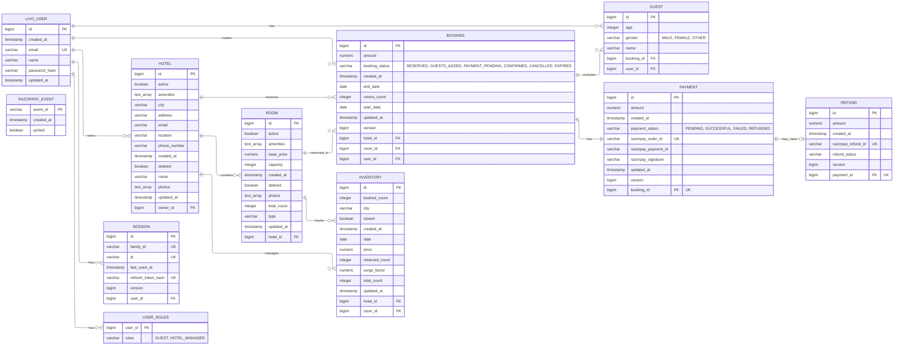

```mermaid
---
config:
  layout: elk
---
erDiagram
	direction LR
	LIVO_USER {
		bigint id PK ""  
		timestamp created_at  ""  
		varchar email UK ""  
		varchar name  ""  
		varchar password_hash  ""  
		timestamp updated_at  ""  
	}
	HOTEL {
		bigint id PK ""  
		boolean active  ""  
		text_array amenities  ""  
		varchar city  ""  
		varchar address  ""  
		varchar email  ""  
		varchar location  ""  
		varchar phone_number  ""  
		timestamp created_at  ""  
		boolean deleted  ""  
		varchar name  ""  
		text_array photos  ""  
		timestamp updated_at  ""  
		bigint owner_id FK ""  
	}
	BOOKING {
		bigint id PK ""  
		numeric amount  ""  
		varchar booking_status  "RESERVED, GUESTS_ADDED, PAYMENT_PENDING, CONFIRMED, CANCELLED, EXPIRED"  
		timestamp created_at  ""  
		date end_date  ""  
		integer rooms_count  ""  
		date start_date  ""  
		timestamp updated_at  ""  
		bigint version  ""  
		bigint hotel_id FK ""  
		bigint room_id FK ""  
		bigint user_id FK ""  
	}
	GUEST {
		bigint id PK ""  
		integer age  ""  
		varchar gender  "MALE, FEMALE, OTHER"  
		varchar name  ""  
		bigint booking_id FK ""  
		bigint user_id FK ""  
	}
	SESSION {
		bigint id PK ""  
		varchar family_id UK ""  
		varchar jti UK ""  
		timestamp last_used_at  ""  
		varchar refresh_token_hash UK ""  
		bigint version  ""  
		bigint user_id FK ""  
	}
	USER_ROLES {
		bigint user_id FK ""  
		varchar roles  "GUEST, HOTEL_MANAGER"  
	}
	ROOM {
		bigint id PK ""  
		boolean active  ""  
		text_array amenities  ""  
		numeric base_price  ""  
		integer capacity  ""  
		timestamp created_at  ""  
		boolean deleted  ""  
		text_array photos  ""  
		integer total_count  ""  
		varchar type  ""  
		timestamp updated_at  ""  
		bigint hotel_id FK ""  
	}
	INVENTORY {
		bigint id PK ""  
		integer booked_count  ""  
		varchar city  ""  
		boolean closed  ""  
		timestamp created_at  ""  
		date date  ""  
		numeric price  ""  
		integer reserved_count  ""  
		numeric surge_factor  ""  
		integer total_count  ""  
		timestamp updated_at  ""  
		bigint hotel_id FK ""  
		bigint room_id FK ""  
	}
	PAYMENT {
		bigint id PK ""  
		numeric amount  ""  
		timestamp created_at  ""  
		varchar payment_status  "PENDING, SUCCESSFUL, FAILED, REFUNDED"  
		varchar razorpay_order_id UK ""  
		varchar razorpay_payment_id  ""  
		varchar razorpay_signature  ""  
		timestamp updated_at  ""  
		bigint version  ""  
		bigint booking_id FK "UK"  
	}
	REFUND {
		bigint id PK ""  
		numeric amount  ""  
		timestamp created_at  ""  
		varchar razorpay_refund_id UK ""  
		varchar refund_status  ""  
		bigint version  ""  
		bigint payment_id FK "UK"  
	}
	RAZORPAY_EVENT {
		varchar event_id PK ""  
		timestamp created_at  ""  
		boolean picked  ""  
	}
	LIVO_USER||--o{HOTEL:"owns"
	LIVO_USER||--o{BOOKING:"makes"
	LIVO_USER||--o{GUEST:"has"
	LIVO_USER||--o{SESSION:"has"
	LIVO_USER||--o{USER_ROLES:"has"
	HOTEL||--o{ROOM:"contains"
	HOTEL||--o{BOOKING:"receives"
	HOTEL||--o{INVENTORY:"manages"
	ROOM||--o{BOOKING:"reserved_in"
	ROOM||--o{INVENTORY:"tracks"
	BOOKING||--||PAYMENT:"has"
	BOOKING||--o{GUEST:"includes"
	PAYMENT||--o|REFUND:"may_have"
```