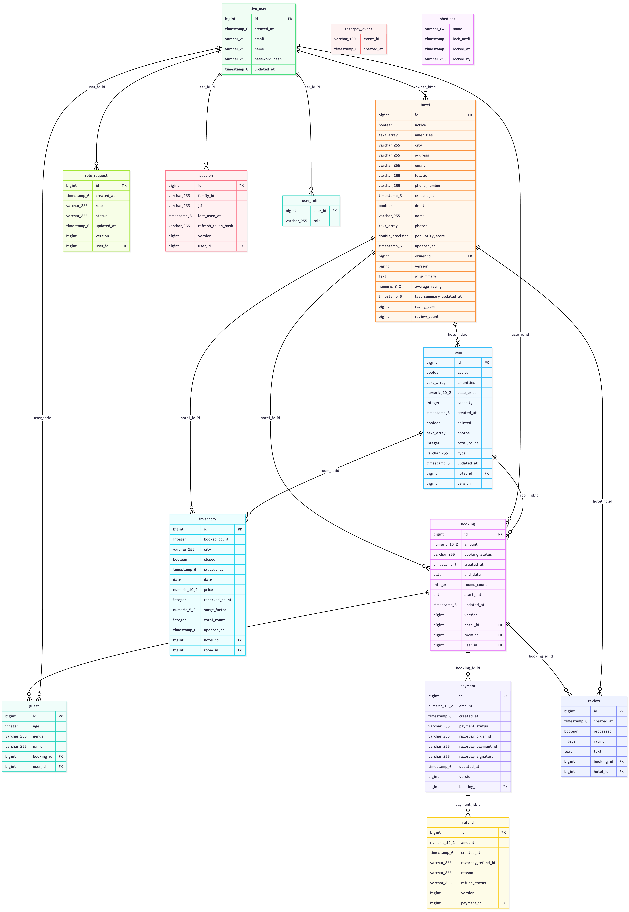

<h1 align="center">Livo</h1>

  A Scalable and Production-Ready Hotel Booking Platform

  

## Overview

Livo is a full-featured hotel booking platform designed to enable hotel managers to list and manage properties while allowing customers to search, book, and manage hotel reservations seamlessly.

The platform manages the complete booking lifecycle, including:

- Property and room management
- Availability search and filtering
- Reservation lifecycle management
- Payment processing and refund handling
- Guest management
- Inventory tracking

## Architecture & Technical Documentation

The detailed system design, architectural decisions, request flows, data modeling strategy, and scalability considerations are documented separately via DeepWiki.

**[View Documentation &rarr;](https://deepwiki.com/pratham-developer/Livo)**

`https://deepwiki.com/pratham-developer/Livo`

## Database Architecture

The following Entity Relationship Diagram represents the core data model and relationships supporting the booking lifecycle.

  

